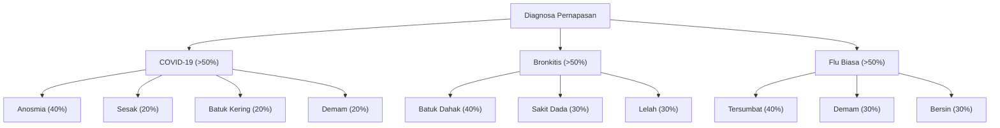

# Sistem Pakar Diagnosis Awal Saluran Pernapasan

Repositori ini berisi implementasi **Sistem Pakar Berbasis Aturan (Rule-Based Expert System)** untuk melakukan diagnosis awal terhadap tiga jenis penyakit saluran pernapasan: **COVID-19**, **Bronkitis**, dan **Flu Biasa**. Sistem ini dikembangkan menggunakan bahasa pemrograman Python dengan pustaka **Experta**.

---

## 🧠 Metodologi: Pembobotan (Scoring) & Ambang Batas

Sistem ini menggunakan pendekatan **Forward Chaining** yang telah dimodifikasi dengan **Metode Pembobotan (Scoring System)**. Berbeda dengan logika kaku yang mengharuskan seluruh gejala terpenuhi, metode ini bekerja dengan cara:

1.  **Akumulasi Skor:** Setiap gejala yang dialami pengguna memiliki bobot persentase tertentu berdasarkan tingkat spesifikasi klinisnya.
2.  **Ambang Batas (Threshold):** Sistem hanya akan memberikan diagnosis jika akumulasi skor gejala untuk penyakit tertentu melampaui **50%**.
3.  **Fleksibilitas:** Memungkinkan sistem memberikan hasil diagnosis yang relevan meskipun data gejala yang diinputkan pengguna tidak lengkap.

---

## 📊 Hierarki Basis Pengetahuan (Knowledge Base)

### 1. Struktur Kamus Data
Untuk efisiensi pemrosesan, variabel penyakit dan gejala dikodekan sebagai berikut:

**Kode Penyakit (P):**
* `P1`: COVID-19
* `P2`: Bronkitis
* `P3`: Flu Biasa

**Kode Gejala (G):**
* `G1`: Demam | `G2`: Batuk Kering | `G3`: Anosmia | `G4`: Sesak Napas
* `G5`: Batuk Berdahak | `G6`: Sakit Dada | `G7`: Kelelahan Fisik
* `G8`: Hidung Tersumbat | `G9`: Bersin-bersin

### 2. Diagram Logika Pembobotan

---

Bash
python sistem_pakar_pernapasan_1.py
Sistem akan mengajukan serangkaian pertanyaan mengenai gejala yang Anda alami. Jawab dengan mengetik y untuk Ya atau n untuk Tidak. Di akhir sesi, sistem akan menampilkan tingkat kecocokan (persentase) dan saran tindak lanjut.

---

## 📝 Kesimpulan Pengembangan
Dalam praktikum ini, dilakukan transisi dari sistem strict rule-based menjadi scoring-based. Hal ini dilakukan untuk menciptakan sistem yang lebih adaptif dan cerdas dalam menangani irisan gejala (seperti demam yang muncul di banyak penyakit) serta memberikan hasil yang lebih realistis menyerupai pola pikir pakar kesehatan di dunia nyata.
